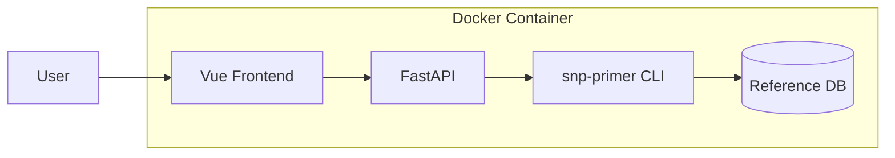

# KASP Primer Design Service - 优化方案 v2

## 1. 核心目标
基于 `SNP_Primer_Pipeline3` 构建 KASP 引物设计 Web 服务。
-   **输入**: SNP 坐标格式 (Pipeline 原生支持)
-   **输出**: 结果表格 + 文件下载

---

## 2. 架构设计

### 2.1 技术选型
| 组件 | 技术 | 说明 |
|------|------|------|
| 前端 | Vue 3 + Vite + Element Plus | 响应式 UI |
| 后端 | **FastAPI** + Uvicorn | REST API，自动文档，原生异步 |
| 容器 | Docker + docker-compose | 一键部署 |
| 运行时 | SNP_Primer_Pipeline3 + BLAST+ | 核心计算 |

### 2.2 组件图


### 2.3 关键优化点

#### ① 异步任务处理
-   **问题**: 大批量 SNP 设计可能耗时较长 (>30s)，同步请求会阻塞。
-   **方案**: 
    -   **MVP (v1.0)**: 同步处理，前端显示 Loading。限制单次最大 SNP 数量 (如 50)。
    -   **v1.1**: 引入 Celery + Redis，后台异步执行，轮询状态。
-   **任务列表更新**: 无需立即实现 Celery，但设计 API 时预留 `job_id` 字段。

#### ② 多参考基因组支持
-   **问题**: 用户可能需要切换不同物种/版本的参考基因组。
-   **方案**: 
    -   后端配置文件 `genomes.yaml` 定义可用基因组列表。
    -   前端下拉选择。
    -   Docker 挂载基因组目录。

#### ③ 错误处理与日志
-   **问题**: 流水线执行失败时用户无法排查。
-   **方案**: 
    -   捕获 `stderr` 并返回给前端。
    -   每次任务生成唯一 `job_id`，日志持久化。

#### ④ 结果文件管理
-   **问题**: 结果文件需要清理，避免磁盘占满。
-   **方案**: 
    -   使用临时目录 + 定时清理 (如 cron 或 APScheduler)。
    -   或基于 `job_id` 设置过期时间 (如 24h)。

---

## 3. API 设计 (优化版)

| 端点 | 方法 | 描述 | 请求/响应 |
|------|------|------|-----------|
| `/api/genomes` | GET | 获取可用基因组列表 | `["wheat_v1", "rice_v2"]` |
| `/api/design` | POST | 提交设计任务 | `{snps, genome, options}` → `{job_id, status}` |
| `/api/job/<id>` | GET | 查询任务状态/结果 | `{status, results?, error?}` |
| `/api/download/<id>/<file>` | GET | 下载结果文件 | Binary |

---

## 4. UI 设计 (科研风格)

### 4.1 设计原则
-   **简洁专业**: 无多余装饰，突出功能
-   **高信息密度**: 表格为主，数据一目了然
-   **低视觉干扰**: 中性色调，避免鲜艳配色

### 4.2 配色方案
```
主色调:  #2C3E50 (深蓝灰 - 标题/按钮)
背景色:  #F8F9FA (浅灰白)
边框色:  #DEE2E6 (灰色)
强调色:  #3498DB (蓝色 - 链接/按钮悬停)
成功色:  #27AE60 (绿色 - 完成状态)
错误色:  #E74C3C (红色 - 错误提示)
```

### 4.3 字体
-   **中文**: 思源黑体 / 系统默认
-   **英文/代码**: `Roboto Mono` / `monospace`
-   **正文**: 14px, 行高 1.6

### 4.4 布局线框
```
┌─────────────────────────────────────────────┐
│  🧬 KASP Primer Design                      │
├─────────────────────────────────────────────┤
│                                             │
│  参考基因组                                 │
│  ┌────────────────────────────────────┐     │
│  │ Wheat v1.0 (IWGSC RefSeq v1.0)  ▼ │     │
│  └────────────────────────────────────┘     │
│                                             │
│  SNP 坐标 (Chr Pos Ref Alt)  [📋 加载示例] │
│  ┌────────────────────────────────────┐     │
│  │ chr7A  7659  T  C                  │     │
│  │ chr7A  7716  A  G                  │     │
│  │                                    │     │
│  └────────────────────────────────────┘     │
│                                             │
│  [  开始设计  ]                             │
│                                             │
├─────────────────────────────────────────────┤
│  设计结果                                   │
│  ┌─────────────────────────────────────┐    │
│  │ SNP ID    │ Allele X │ Allele Y │ Common │
│  ├───────────┼──────────┼──────────┼────────┤
│  │ chr7A-... │ ATCG...  │ ATCG...  │ ATCG.. │
│  └─────────────────────────────────────┘    │
│                                             │
│  📥 下载摘要    📥 下载完整结果             │
└─────────────────────────────────────────────┘
```

### 4.5 交互功能
| 功能 | 说明 |
|------|------|
| **加载示例** | 点击后自动填充测试 SNP 数据并选择 `test_reference` 基因组 |
| **开始设计** | 提交后显示 Loading，完成后展示结果表格 |
| **下载** | 支持下载 `all_KASP_primers_summary.txt` 和 `all_KASP_primers.txt` |

### 4.6 组件规范
| 组件 | 样式 |
|------|------|
| 按钮 | 圆角 4px, 无阴影, 实心填充 |
| 输入框 | 边框 1px, 内边距 12px |
| 表格 | 斑马纹, 固定表头, 水平滚动 |
| 链接 | 蓝色 #3498DB, 下划线悬停 |
| Loading | 简单 spinner, 无动画过渡 |

---

## 5. Docker 部署策略

### 5.1 镜像结构
```dockerfile
# Stage 1: Build Frontend
FROM node:20-alpine AS frontend
WORKDIR /app
COPY frontend/ .
RUN npm ci && npm run build

# Stage 2: Runtime
FROM python:3.10-slim

# 安装系统依赖
RUN apt-get update && apt-get install -y --no-install-recommends \
    ncbi-blast+ \
    git \
    && rm -rf /var/lib/apt/lists/*

# 从 GitHub 安装 SNP_Primer_Pipeline3
# 可指定版本: git+https://github.com/bioShaun/SNP_Primer_Pipeline3.git@v1.0.0
RUN pip install --no-cache-dir \
    git+https://github.com/bioShaun/SNP_Primer_Pipeline3.git \
    fastapi uvicorn[standard]

# 复制应用代码
COPY --from=frontend /app/dist /app/static
COPY backend/ /app
WORKDIR /app

EXPOSE 8000
CMD ["uvicorn", "main:app", "--host", "0.0.0.0", "--port", "8000"]
```

> [!TIP]
> 可通过 `@tag` 或 `@commit` 锁定版本，如:
> `git+https://github.com/bioShaun/SNP_Primer_Pipeline3.git@v1.0.0`

### 5.2 docker-compose.yml
```yaml
services:
  kasp:
    build: .
    ports:
      - "8000:8000"
    volumes:
      - /path/to/genomes:/data/genomes:ro
    environment:
      - GENOME_CONFIG=/app/genomes.yaml
```

---

## 6. 优化后的任务列表

### Phase 1: 基础搭建
- [ ] 初始化项目结构 (backend/, frontend/)
- [ ] 创建 FastAPI 骨架 (main.py, config.py)
- [ ] 创建 Vue 3 项目 (Vite + Element Plus)
- [ ] 编写 Dockerfile (多阶段构建)
- [ ] 编写 docker-compose.yml

### Phase 2: 后端实现
- [ ] 实现 `/api/genomes` (读取配置)
- [ ] 实现 `/api/design` (调用 snp-primer CLI)
- [ ] 实现 `/api/job/<id>` (MVP: 直接返回结果)
- [ ] 实现 `/api/download/<id>/<file>`
- [ ] 添加错误处理和日志

### Phase 3: 前端实现
- [ ] 实现输入表单 (基因组选择 + SNP 输入)
- [ ] 实现结果表格 (Element Plus Table)
- [ ] 实现下载按钮
- [ ] 添加 Loading 状态和错误提示

### Phase 4: 测试与验证
- [ ] 构建 Docker 镜像
- [ ] 使用测试数据验证端到端流程
- [ ] 验证下载功能

---

## 7. 验证计划

### 7.1 测试数据
测试数据位于 `test_data/` 目录：

| 文件 | 说明 |
|------|------|
| `snp_pos_example.txt` | 示例 SNP 坐标输入 |
| `blastdb/test_reference.fa` | 测试用参考基因组 (已建立 BLAST 索引) |

**示例输入内容**:
```
chr7A	7659	T	C
chr7A	7716	A	G
```

### 7.2 单元测试
-   **命令**: `pytest backend/tests/`
-   **覆盖**: SNP 输入解析、命令构造

### 7.3 集成测试 (Docker)
```bash
# 启动服务
docker-compose up -d

# 测试 API
curl -X POST http://localhost:8000/api/design \
     -H "Content-Type: application/json" \
     -d '{"snps": "chr7A\t7659\tT\tC\nchr7A\t7716\tA\tG", "genome": "test_reference"}'
```

### 7.4 手动验证
1. 打开 `http://localhost:8000`
2. 选择参考基因组: `test_reference`
3. 输入 SNP 坐标 (从 `snp_pos_example.txt` 复制)
4. 点击"开始设计"
5. 验证表格显示结果
6. 点击下载，确认文件内容

